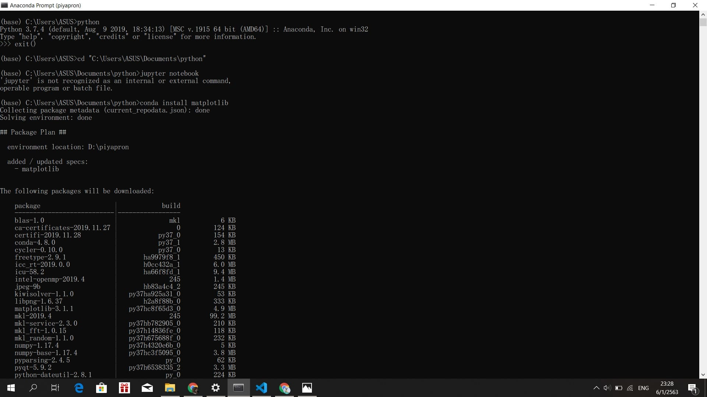
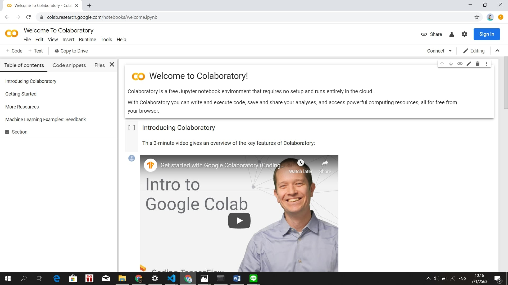
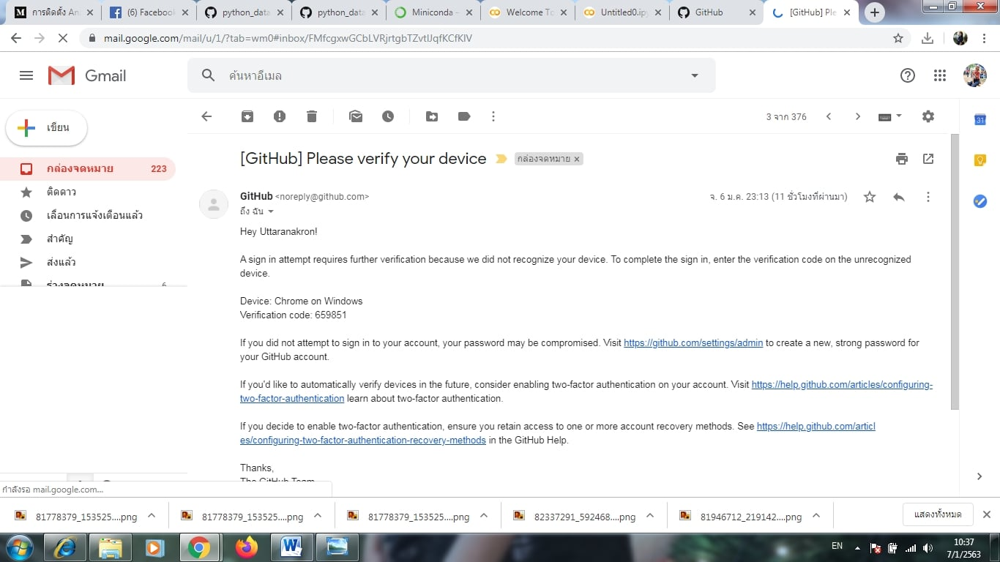

# Home Work1

## การติดตั้ง Miniconda บน Windows
1.	เข้าเว็บบราวน์เซอร์แล้วพิมพ์ Miniconda
2.	เลือกอันแรกที่ปรากฏ

3.	เลือกดาวน์โหลดเวอร์ชันสำหรับระบบปฎิบัติการ Windows

4.	คลิกเลือกที่ Python 3.7Miniconda3 Windows 64-bit 

5.	ดับเบิลคลิกไฟล์ที่ดาวน์โหลดมาเพื่อติดตั้ง Miniconda

6.	คลิกที่ปุ่ม Next

7.	คลิกที่ปุ่ม I Agree

8.	 เลือก Just Me (recommended)

9.	คลิกที่ปุ่ม Next

10.	เลือก Add Anaconda to my PATH environment variable แล้วคลิกปุ่ม Install
11.	รอจนกว่าการติดตั้งจะเสร็จสมบูรณ์

12.	เมื่อติดตั้งเสร็จสมบูรณ์แล้วให้คลิกปุ่ม Next

13. คลิกที่ปุ่ม Finish

14.	กดปุ่มรูปwindows หรือปุ่ม start menu ค้นหา Anaconda

15.	พิมพ์  “python” เพื่อเช็คดูความถูกต้องของ Anconda
16.	ตั้งค่าให้ jupyter จัดเก็บ Folder ที่ต้องการ * ใช้คำสั่ง cd "____"                  URL ไฟล์ที่เราจัดเก็บ
17.	ใช้คำสั่ง install jupyter notebook

18.	ติดตั้ง matplotlib
-	ใช้คำสั่ง conda install matplotlib

## วิธีการใช้งาน GOOGLE COLAB
-	ซึ่งข้อดีของ GOOGLE COLAB คือสามารถใช้งานบนเครื่องคอมพิวเตอร์เครื่องใดก็ได้ 
-	ข้อเสียคือต้องเชื่อมต่อ Internet ตลอดเวลาที่เข้าใช้งาน
1.	เข้าไปที่หน้าเว็บ GOOGLE COLAB
2.	 login เข้าสู่ระบบ กดคลิกที่ Sing in 

3.	จากนั้นเลือก New python 3 notebook

4. เข้าสู่หน้า python

## วิธีการใช้งาน git hub
1.	เข้าไปที่หน้าเว็บ git hub

2.	สมัครเข้าใช้งาน git hub 

3.	เลือก sign up for git hub

4.	Create account
5.	เปิด E-mail เพื่อยืนยันการสมัคร

6.	เชื่อมต่อเข้ากับ Anconda
7.	พิมพ์ git add เพื่อเพิ่มไฟล์
8.	พิมพ์ git commit -m "test git"
9.	พิมพ์ git push
10.	เข้าสู่ระบบตาม Username และ password ที่สมัครไว้
